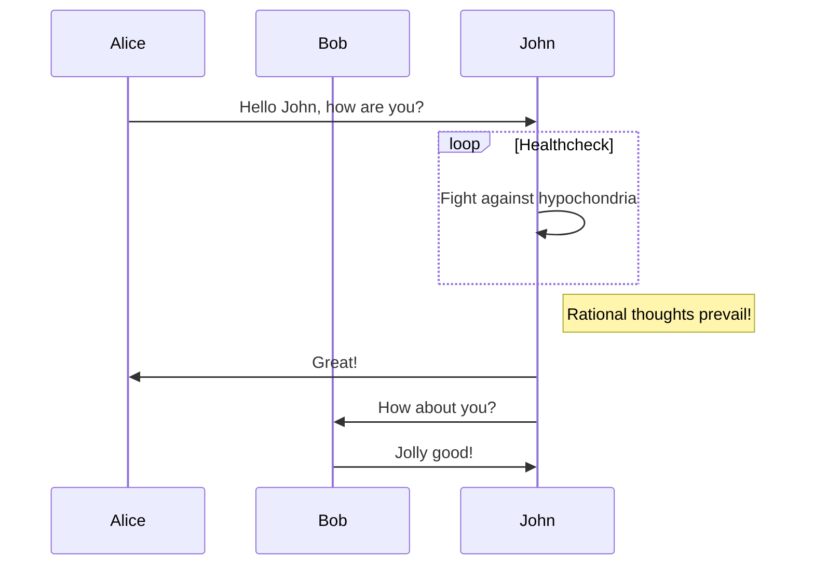

# Welcome

## Welcome to the home of your new documentation


### Setting up

The first step to world-class documentation is setting up your editing environnments.

:::: cols=2

[[card this the title]]
This is the content
[[/card]]

[[card another title]]
#### test
This is the content
[[/card]]

[[card this the title](/link/to)]
This is the content
[[/card]]

(/link/to)[[card this the title]]
This is the content
[[/card]]
::::


Anyone on your account with permission to view reports can write queries. To execute your query and see the results, click Run. More complex queries might take a few moments longer to complete and display results. Attempting to run an invalid query generates an error message that contains the line number and position of the error.

The following query uses the balance_transactions table to get information about the five most recent balance transactions related to refunds.



Normal tabs

:::: tabs

::: tab python
__markdown      `sadas`
:::


::: tab javascript
```javascript {1,4,6-7}
() => {
  console.log('Javascript code example')
}
```
:::

::::

Code group 

:::: tabs-code-group

::: tab python
__markdown      `sadas`
:::


::: tab javascript
```js {1,4,6-7}
() => {
  console.log('Javascript code example')
}
```
:::

::::


[[note This is a note title]]
This endpoint requires authenticate via `TGX-API-KEY` and `TGX-API-SECRET` headers. You can find your API credentials under account dashboard.
and more :)
[[/note]]

---

[>](https://www.loom.com/share/7b3264eaa809426e905b13f7a506e2bc)

[[info]]
This endpoint requires authenticate via `TGX-API-KEY` and `TGX-API-SECRET` headers. You can find your API credentials under account dashboard.
[[/info]]

[[tip]]
This endpoint requires authenticate via `TGX-API-KEY` and `TGX-API-SECRET` headers. You can find your API credentials under account dashboard.
[[/tip]]

[[warning]]
This endpoint requires authenticate via `TGX-API-KEY` and `TGX-API-SECRET` headers. You can find your API credentials under account dashboard.
[[/warning]]

[[danger]]
This endpoint requires authenticate via `TGX-API-KEY` and `TGX-API-SECRET` headers. You can find your API credentials under account dashboard.
[[/danger]]


[[toggle several words that toggle]]
⚠️ This endpoint requires authenticate via `TGX-API-KEY` and `TGX-API-SECRET` headers. You can find your API credentials under account dashboard.

- item 1
- item 2
[[/toggle]]

Tradologics introduced a new way to structure, test, and deploy automated trading strategies, which makes it the fastest way to go from idea to trading without infrastructure headaches.

[[boxed float-right]]

### Header
In order for Tradologics to be able to do so much, while still getting out of your way, we needed to take a radically different approach. We broke down a "traditional" trading platform into its core components and make them available as separate, cloud-hosting style, products.
[[/boxed]]

By providing you with **limitless combinations**, Tradologics acts as your **Trading Operating System** - an approach that offers a better, more efficient solution to resolve the many issues that programmatic traders are facing.

> “You can think of Tradologics' product line as a trading LEGO® kit. Some assembly is, of course, required - but you end up with a trading platform that fits your needs perfectly.”
>
> – **Ran Aroussi**, Founder @ Tradologics

## Agnostic philosophy

Openness is at the heart of the Tradologics approach to trading.

We don't believe that it's our place to tell you how to work, who to work with, or how to structure your code. That's why the Tradologics Cloud Platform is **broker, market, language, and framework agnostic** – allowing you the flexibility to express yourself the way that makes sense to you.

You can execute trades on any of the brokers and exchanges supported by Tradologics using the same standardized and [Universal API](/docs/api) – allowing you to move between brokers without any changes to your code.

We also don't use a coding framework. Feel free to **code in 8 programming languages** and structure your code the best way that you see fit and use any of our [API endpoints](https://tradologics.developerhub.io/docs/api/ref) to trade.

[[info]]
While we don't offer a coding framework that compels you to study it and comply with its design decisions, we do offer SDKs with many utility functions to streamline your workflow.
[[/info]]

In short: **You do you. We'll be here to facilitate.**

## Architecture <a href="#architecture" id="architecture"></a>

### Abstracted <a href="#abstracted" id="abstracted"></a>

Thanks to Tradologics' architecture, strategy logic is compartmentalized. Each section in your [strategy](https://tradologics.developerhub.io/-) is responsible for one thing, and one thing only: either generating signals, acting on positions' PnL, handling order status changes, etc. This results in a **cleaner, more manageable code**, that's also less prone to bugs and look ahead biases.

### Distributed and event-based <a href="#distributed-and-event-based" id="distributed-and-event-based"></a>

Trading strategies on Tradologics take a **passive approach**, meaning that instead of chasing data, you describe what to do in certain events and then wait for them to happen. [Tradehooks](https://tradologics.developerhub.io/docs/guides/tradehooks), our data delivery engine, will push relevant information to your strategy, including market data, order status changes, price triggers, and PnL thresholds as they become available.

#### **How data flows on the Tradologics cloud**


## Many-to-many relationships <a href="#many-to-many-relationships" id="many-to-many-relationships"></a>

Every Tradologics component can work with multiple other components.

This means that a single strategy can execute trades via multiple brokers, and receive data in multiple time intervals, for multiple securities, and in multiple bar resolutions. A single price or position monitor can alert multiple strategies once triggered, etc.

[[toggle Single strategy → Multiple brokers]]

Execute trades on multiple brokers and exchanges from a single strategy.

* Trade `TSLA` on IBKR, `BTC` on FTX, and `EURUSD` on Oanda for the ultimate Tesla trading strategy.
* Spread your `BTC` trades across multiple exchanges to reduce the risk associated with having all your eggs in one basket.

[[/toggle]]

[[toggle Multiple Tradehooks/Monitors → Single strategy]]

A single strategy subscribes to multiple Tradehooks and/or monitors to receive data of multiple securities, in multiple time intervals, and in multiple bar resolutions.

* Receive 1-minute bars for `AAPL` and `GBPJPY` (for signal calculation) every 15 minutes (for signal generation), and a 1-hour bar of `VIX` every hour for risk management.
* Have a monitor notify your strategy when `AAPL` 's price crosses above $200, and another monitor when the price goes below $50.
* Use several time horizons (weekly, daily, and intraday) to confirm the market regime when generating signals.

[[/toggle]]

[[toggle Single Tradehook/Monitor → Multiple strategies]]

Save time by re-using Tradehooks and/or monitors by "attaching" them to multiple strategies that should be made aware of that data.

* Let some (of all) of your strategies know when `VIX` goes above 40, to use as a potential regime change indicator.
* Let **Strategy A** (trades `TSLA` ) AND **Strategy B** (trades `EURUSD`) know when **Strategy C**'s `BTC`-position experiencing a 5% intraday loss.

[[/toggle]]


## Up next... <a href="#up-next" id="up-next"></a>

Now that you have that in mind, go and familiarize yourself with Tradologics' main "building blocks".

Getting support is nice

[+] [test article 1]({base_url}/docs/some-article)
[+] [test article 2]({base_url}/docs/some-article)
[+] [test article 3]({base_url}/docs/some-article)
