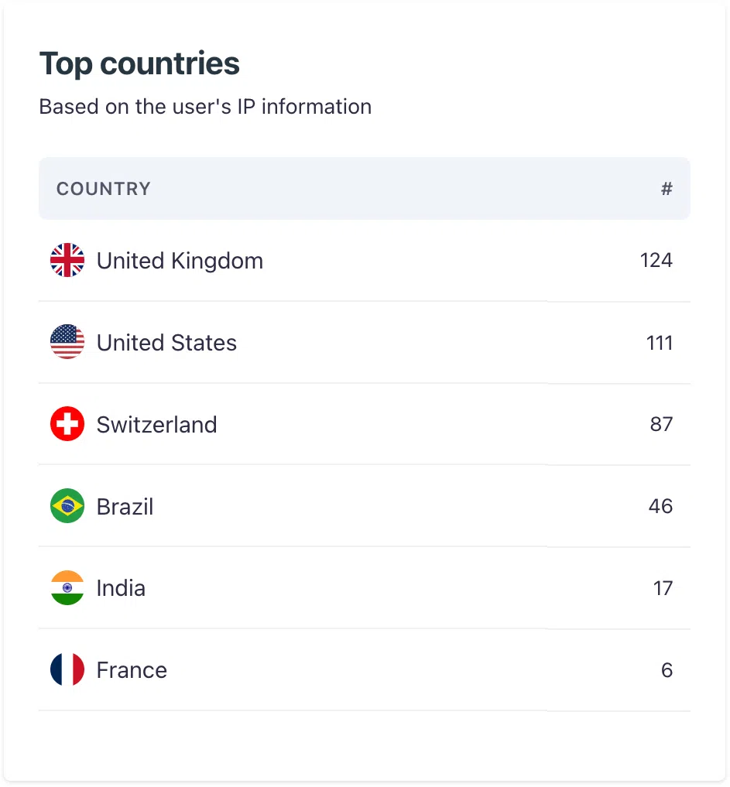
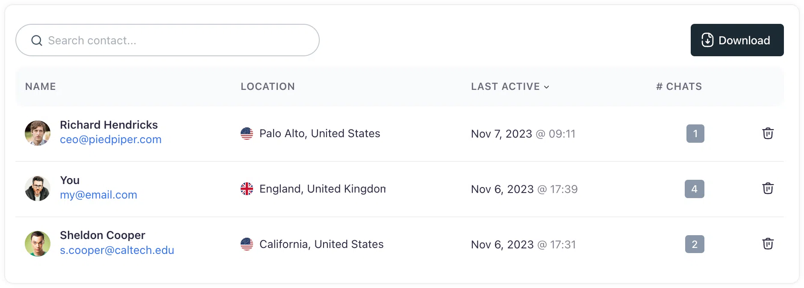

# Usage and analytics
## Unveiling user interactions with your Chatbot and harnessing insights for enhanced performance

Corpus' activity pages are a window into the world of your users, offering a wealth of information about how they engage with your chatbot. These pages are instrumental in refining the chatbot's effectiveness and ensuring that user interactions are as productive as possible.

## Engagement insights

- **Usage statistics:** Delve into data that shows how often and in what ways users interact with your chatbot.
- **Interaction summaries:** Access summaries of the most commonly asked questions, providing insight into user needs and interests.

:::: cols=2

::::

## Know your audience

- **User information:** View detailed profiles of your users, including their geo-location and chat history. Identified users will display their name and email, while anonymity is preserved for others.
- **Crm integration:** Seamlessly export your contact list for use in your CRM or email marketing tools, enhancing your outreach strategies.

## Access chat history

- **Conversation review:** Explore the dialogues between your chatbot and users, complete with feedback through up or down votes on the chatbot's responses.
- **Content creation:** Identify gaps in your chatbot's knowledge and create new documents to address frequently asked questions directly from the chat session interface.

## Navigating the insights page

- **Usage statistics:** View detailed statistics to understand the volume and patterns of usage over time.
- **Interaction summaries:** Review summaries of user interactions to see what topics are trending and where your chatbot excels or needs improvement.

## Summary

The activity pages within Corpus offer a comprehensive suite of tools to monitor, analyze, and act upon the interactions that users have with your chatbot. By leveraging these insights, you can continuously improve the chatbot experience, ensuring that every conversation leads to a more informed and satisfied user.
