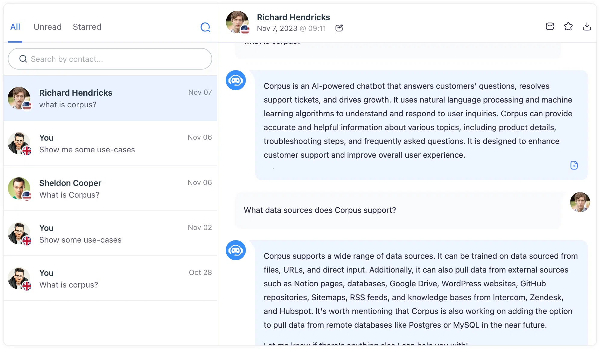

# Accessing chat history
## Delve into user dialogues with your chatbot, and track interactions to refine AI responses

The Chat History Page is an invaluable feature of Corpus that offers a detailed look at the conversations between users and your chatbot. This page is pivotal for assessing the chatbot's performance and identifying opportunities for enhancement.

## Insights into user interactions

- **Conversation records:** View the full dialogue history, providing a complete picture of how users are using the chatbot and the types of questions they are asking.
- **Response feedback:** Monitor the feedback on the chatbot’s answers with the up or down voting system, which helps gauge the accuracy and helpfulness of the information provided.
- **Direct document creation:** When you identify frequently asked questions or topics that require better clarity, you can directly create and link new documents to these queries from the Chat History Page.

## Summary

The Chat History Page is more than a log; it is a strategic tool that not only helps in understanding user behavior but also plays a crucial role in the continuous learning and development of your chatbot. Through this page, Corpus provides a feedback loop that is essential for maintaining and improving the quality and relevance of your chatbot's interactions.
