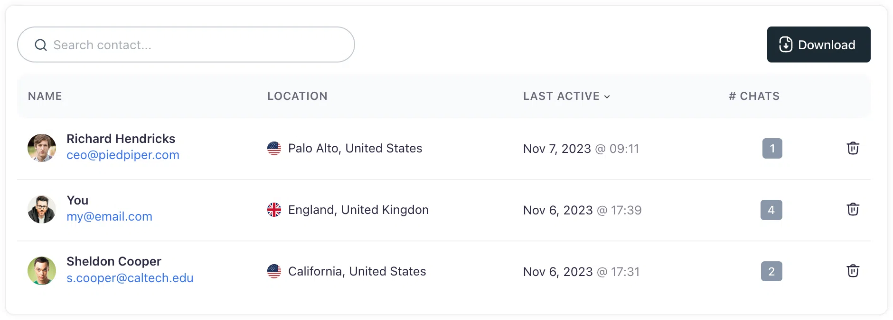

# Contact list
## Navigating and exporting contacts in Corpus

Corpus' Contacts Page serves as the central hub for managing and understanding your chatbot's interactions with users. It offers a comprehensive view of user details and their engagements with your AI assistant, providing a base for personalized communication and marketing strategies.

## Detailed user information

- **Identified user profiles:** For users who have introduced themselves, the Contacts Page displays their name and email, giving you direct access to reach out for follow-up communication.
- **Anonymized interactions:** Users who have not been identified are assigned anonymized names to respect their privacy while still allowing you to review their interaction patterns.
- **Crm integration:** With the ability to export your contact list, you can easily integrate these leads into your Customer Relationship Management system or email marketing software, extending the reach of your engagement strategies.
- **Location insights:** Understand where your users are interacting from with integrated geolocation data, helping to tailor your services to specific regions.
- **Chat review:** Dive into the history of conversations each user has had with your chatbot, gaining context for their questions and your chatbot's responses.

## Summary

The Contacts Page in Corpus is more than just a list; it's a dynamic tool that arms you with actionable insights into your users. By understanding who your users are, where they come from, and what they're asking, you can refine your marketing tactics, improve customer service, and drive your business forward with a data-informed approach.
