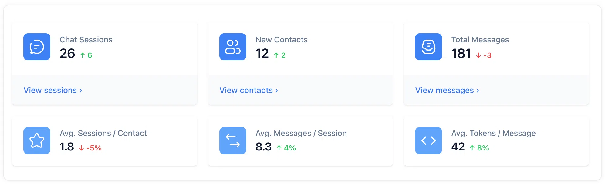
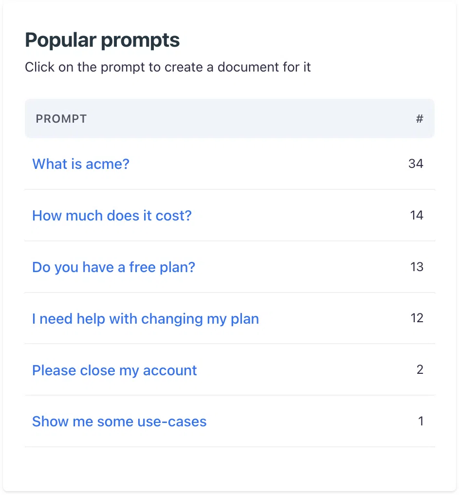
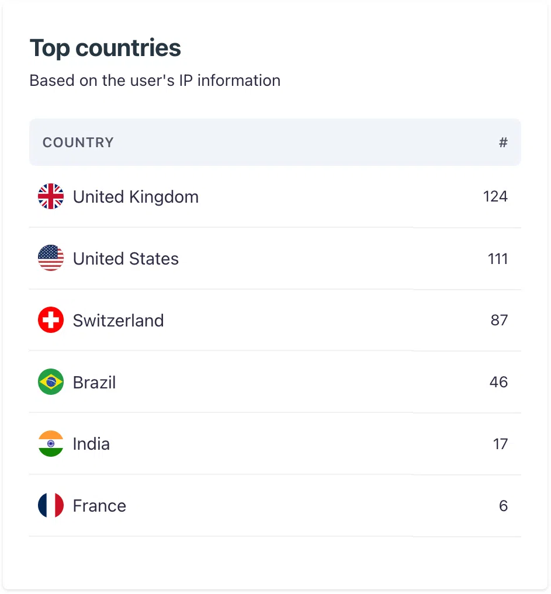

# Insights analytics
## Understand your audience and gauge user engagement and chatbot efficacy

The Insights Analytics Page in Corpus provides a crucial analytical perspective on user interactions with your chatbot. It's here that you can gauge the effectiveness of your AI assistant and understand the behavior and preferences of your users.

## Key features of the insights page

- **User interaction analysis:** Get a clear view of how users are engaging with your chatbot. Determine the points of high interaction and identify any potential drop-off zones.
- **Answer evaluation:** Assess the usefulness of the chatbot's responses through user feedback, allowing you to continuously refine and improve the AI's performance.
- **Frequently asked questions:** Gain insight into the most common inquiries posed to your chatbot. This knowledge is invaluable for optimizing the chatbot's knowledge base and training materials.

## Navigating the insights page

- **Usage statistics:** View detailed statistics to understand the volume and patterns of usage over time.
- **Interaction summaries:** Review summaries of user interactions to see what topics are trending and where your chatbot excels or needs improvement.

:::: cols=2

::::

## Summary

The Insights Analytics Page is a powerful tool in your Corpus toolkit, providing a data-driven approach to understanding and enhancing your chatbot's interactions with users. By analyzing this data, you can make informed decisions to tailor your chatbot to better meet the needs of your audience, improving satisfaction and engagement.
