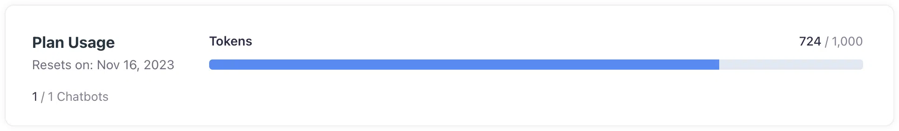

# Subscription and billing
## Subscription plans, billing, and client portal

Corpus has integrated Stripe, a leading online payment processing platform, to manage subscriptions and payments seamlessly. This document guides you through the billing and subscription management process for your Corpus account.

## Subscription plans

To understand the specifics of each plan's token allocation and features, refer to the <a href="https://app.corpus.chat/settings/billing" target="corpus-webapp">billing page</a> on the web app or explore the <a href="https://corpus.chat/pricing" target="pricing-page">pricing page</a> on our website.

## Subscription changes

Upon selecting a subscription plan, you'll be directed to Stripe's secure checkout page to complete your payment details, activating your subscription without delay.

[[info]]
Should you decide to upgrade your plan, payments will be prorated, ensuring you only pay for the difference based on the remaining time in your billing cycle.
[[/info]]

## Monitoring token usage

Your monthly token usage is updated in real-time and is available on the billing page of the Corpus web application.

## Stripe customer portal

For any changes to your payment details or to view past transactions, access Stripe's client portal by selecting the <kbd>View billing portal</kbd> link located at the bottom of the billing page. The client portal also provides options to view past invoices and download them for your records.

## Summary

Your Corpus subscription is designed to be as straightforward and transparent as possible, with easy access to your usage, billing information, and invoices. By partnering with Stripe, we ensure that your payment information is handled securely and that your subscription management is hassle-free.
