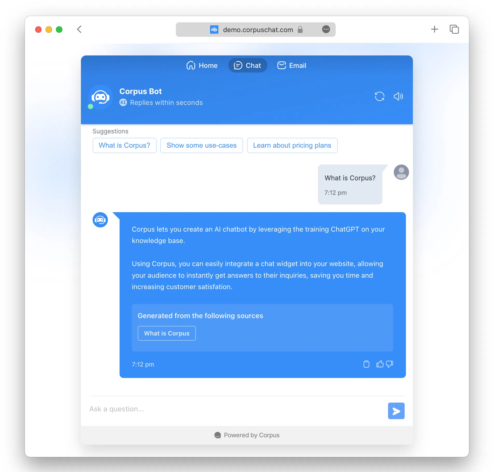

# Sharing your chatbot with users
## Learn about the various ways you can enable your users to interact with your chatbot

Corpus offers versatile options for sharing your chatbot with users. Whether you want to provide access through a public URL, utilize a custom domain, or integrate the chatbot directly onto your website, Corpus has the flexibility to suit your distribution needs. This guide will walk you through each sharing method and explain how to manage access effectively.

## Add the widget to your website

You can achive the most integrated experience by embedding the chatbot widget directly on your site. Corpus provides a snippet of JavaScript code that you can insert into your website's HTML. This allows the chatbot to live within your website's ecosystem, offering users help and interaction as they browse.

[[note Restrict access to your widget]]
To enhance security and control over where your chatbot can be accessed, Corpus enables you to restrict the domains that can embed your chatbot widget. You can specify which websites are permitted to display your chatbot, preventing unauthorized use on other domains.
[[/note]]

## Sharing the public link

Every Corpus chatbot is assigned a public URL, which is active by default. This URL follows the format `project-id.corpuschat.app` and serves as the simplest way to share your chatbot. Users can visit this link to interact with your chatbot immediately.

### Disabling public pages

If you prefer not to have a standalone public chatbot page, you can disable this feature. This might be suitable for businesses that wish to offer the chatbot experience solely within the confines of their existing website infrastructure. For more information about sharing settings, refer to [Public Chatbot Page Guide ›](/sharing/public-url.md)

Remember, even with the public page disabled, you can still share your chatbot by embedding it on your website.

### Using a custom domain

For a more branded experience, especially if you're on the Pro or Max plans, you can set a custom domain or subdomain (like `chat.yourdomain.com`). To learn about adding a subdomain, visit [Custom Domain Guide ›](/sharing/custom-domain.md)

## Summary

Sharing your Corpus chatbot is a flexible and secure process that can be tailored to your business's needs. Whether through a public URL, a custom domain, or direct embedding on your site, you have control over how users interact with your chatbot. Additionally, you can restrict widget access to specific domains or disable the public page altogether for exclusive, domain-specific engagements. With these sharing capabilities, Corpus ensures that your chatbot reaches your audience in the most effective and brand-cohesive way possible.
