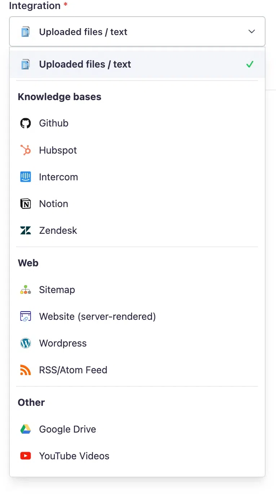
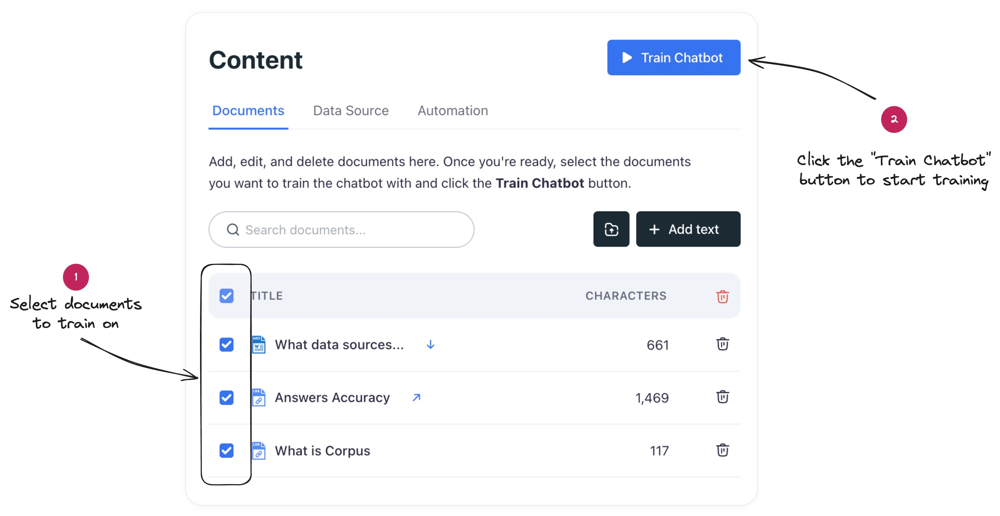

# Training your chatbot on custom data
## Equip your chatbot with business-specific intelligence through custom training

Training is a fundamental process in the realm of artificial intelligence, especially when it comes to chatbots. It involves feeding the AI model with relevant data, allowing it to learn and subsequently generate accurate and contextually appropriate responses. Think of it as educating a new employee on your company's knowledge base so they can perform their role effectively.

## Custom data integration

Corpus takes this process a step further by giving you the ability to train your chatbot using a variety of data sources:

- **File uploads:** Easily add knowledge by uploading documents, including MS Office files, PDFs, and more.
- **App creation:** Directly craft documents within the app, tailoring information to your needs.
- **Web fetching:** Automatically pull data from your website or online materials for the chatbot to learn.
- **External sources connection:** Link knowledge from to many popular platforms, including as Notion, GitHub, YouTube, Google Drive, HubSpot, Intercom, Zendesk, and even SQL databases to enrich the chatbot's knowledge pool.

## The training process

Activating your chatbot's learning is as simple as adding your selected content and initiating the training:

1. **Content addition:** Compile and add the content you wish your chatbot to learn from.
2. **Training initiation:** Click on the "train" button to start the process.
3. **Duration:** Training duration varies, ranging from a swift 30 seconds to a few minutes, depending on the volume and complexity of the documents involved.

## Post-training capabilities

Once the training session concludes, your chatbot becomes a more efficient assistant. The chatbot will now be able to reference the content it was trained on when generating responses to questions, akin to an employee using their knowledge to solve problems.

## Summary

By undergoing the training process, your Corpus chatbot becomes a powerhouse of information, ready to serve your customers with information that is tailored to your organization's wealth of knowledge. The simplicity of the training process belies the profound impact it has on the chatbot's performance, transforming it into an invaluable resource for your customer support strategy.
