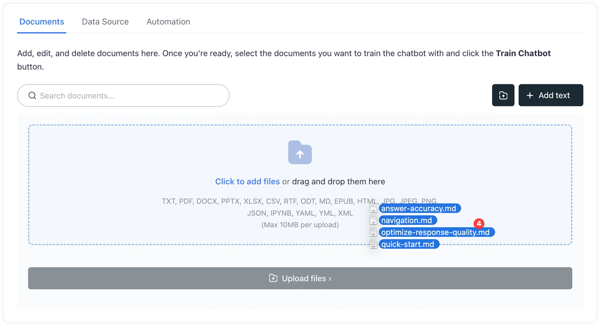

# Train your chatbot on uploaded files
## A step-by-step guide on how to add your content to Corpus, enabling your chatbot to learn and provide accurate, informed responses based on your data.

> [Placeholder: Video Tutorial]

## Upload your content

- Navigate to the **Knowledge** screen, and click on the <kbd style="margin-bottom:-7px"><svg xmlns="http://www.w3.org/2000/svg" viewBox="0 0 24 24" fill="none" style="width:14px;height:14px">
<path d="M2 9V8.50012V6.8C2 5.11984 2 4.27976 2.32698 3.63803C2.6146 3.07354 3.07354 2.6146 3.63803 2.32698C4.27976 2 5.11984 2 6.8 2H8.31672C9.11834 2 9.51916 2 9.88103 2.09146C10.4791 2.24262 11.016 2.57444 11.4186 3.04174C11.6623 3.32451 11.8415 3.683 12.2 4.4V4.4C12.439 4.878 12.5585 5.11699 12.7209 5.30551C12.9894 5.61704 13.3473 5.83825 13.746 5.93902C13.9872 6 14.2544 6 14.7889 6H16.4999C17.8956 6 18.5934 6 19.1612 6.17227C20.4396 6.56008 21.4399 7.56044 21.8277 8.83877C22 9.40661 22 10.1044 22 11.5001V11.5001V12M2 13.0002V13.5001V15.6C2 17.8402 2 18.9603 2.43597 19.816C2.81947 20.5686 3.43139 21.1805 4.18404 21.564C5.03968 22 6.15979 22 8.4 22H16.5001C17.8956 22 18.5933 22 19.161 21.8278C20.4395 21.44 21.44 20.4395 21.8278 19.161C22 18.5933 22 17.8956 22 16.5001V16.5001V16M12 17.0005V11.0005M12 11.0005L14.5 13.5005M12 11.0005L9.5 13.5005" stroke="currentColor" stroke-width="2.5" stroke-linecap="round" stroke-linejoin="round"></path></svg></kbd> (add files) button.
- Drag and drop the files your wish to upload (or click on the upload area) to add them to your chatbot.

[[info]]
You can upload the following PDF documents, text files (<code>TXT/RTF</code>), MS Word (<code>DOC/DOCX</code>), PowerPoint (<code>PPT/PPTX</code>), Excel (<code>CSV/XLSX</code>), Open Documents (<code>ODT</code>), Markdown files (<code>MD</code>), Ebooks (<code>EPUB</code>), HTML files, images (<code>JPG/JPEG</code> and <code>PNG</code>), and various programming files (<code>JSON</code>, <code>IPYNB</code>, <code>YML/YAML</code>, and <code>XML</code>) — up to a maximum of 10MB per file.
[[/info]]

## Initiate the training process

<!-- To train your chatbot on the content you've added: -->

- **Select content for training:** Select the documents you wish to use for training.
- **Initiate the training process:** Click on the <kbd>Train Chatbot</kbd> button at the top of the screen.

Once training is complete, a notification will confirm that your chatbot is ready to use the new data.

## Summary

With these simple steps, you can empower your Corpus chatbot with the knowledge it needs to serve your customers more effectively.
