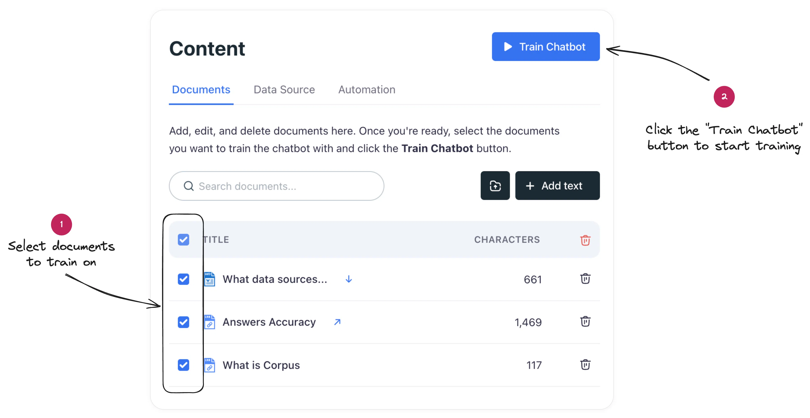

# Train your chatbot on custom data
## A step-by-step guide on how to add your content to Corpus, enabling your chatbot to learn and provide accurate, informed responses based on your data.

> [Placeholder: Video Tutorial]

## Add your content

- Navigate to the **Knowledge** screen, and click on the <kbd>Add Text</kbd> button.
- Using the window that appears, add your content to the chatbot (Markdown is supported).
- To have the chatbot link to a URL when composing an answer, simply supply the target URL.

[[tip Fetch text from a URL]]
You can also add text from a URL by typing in the URL at the document editor and clicking on the <kbd>Fetch Page</kbd> button.
[[/tip]]

## Initiate the training process

<!-- To train your chatbot on the content you've added: -->

- **Select content for training:** Select the documents you wish to use for training.
- **Initiate the training process:** Click on the <kbd>Train Chatbot</kbd> button at the top of the screen.

Once training is complete, a notification will confirm that your chatbot is ready to use the new data.

## Summary

With these simple steps, you can empower your Corpus chatbot with the knowledge it needs to serve your customers more effectively.
