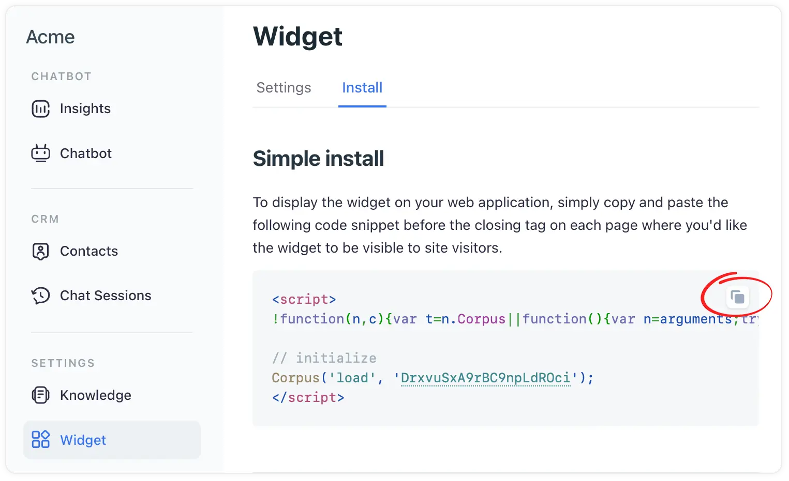

# Add the widget to your Webflow website
## Integrating AI-powerd chat support with custom code

Adding the Corpus chatbot widget to your Webflow website enhances user engagement and provides seamless support. This guide will demonstrate how to embed the Corpus widget into your Webflow site using the 'Custom Code' feature in the 'Site Settings', focusing on adding the code to the 'Head Code' section.

## Instructions

### 1: Locate the Widget’s JavaScript snippet

- **Log into Corpus:** <a href="https://app.corpus.chat" target="app">Log into your Corpus account</a>.
- **Select your chatbot:** Choose the chatbot you wish to embed from your list of available chatbots (if you have more than one).
- **Navigate to widget installation:** Go to "Widget → Install" in the Corpus dashboard.
- **Copy the JavaScript snippet:** Locate the JavaScript snippet at the top of that page, and copy it.

### 2: Embedd the snippet in Webflow

- **Open Webflow site settings:** Log into your Webflow account and select your project. Go to the 'Site Settings'.
- **Locate the “custom code” section:** In the 'Site Settings', find the 'Custom Code' tab.
- **Paste in head code:** Scroll to the 'Head Code' section and paste the copied JavaScript snippet from Corpus here. This will ensure the chatbot loads on every page of your site.
- **Save and publish:** After pasting the code, save the changes and publish your site to apply the updates.

## Summary

By embedding the Corpus chatbot widget in the 'Head Code' section of your Webflow site's settings, you ensure a consistent and engaging user experience across your entire website. This integration not only enhances user interaction but also provides a valuable support tool, seamlessly fitting into your site's design and functionality.

