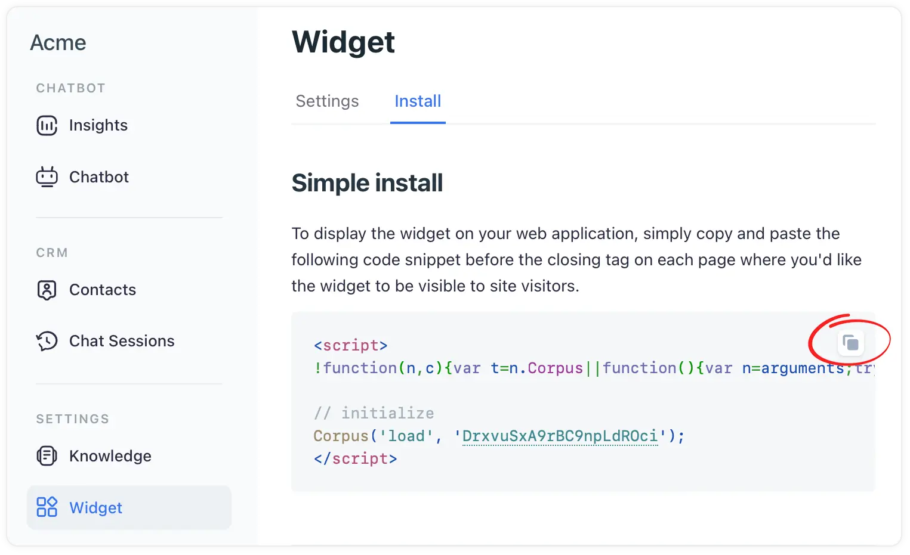

# Add the widget to your Framer website
## Effortlessly embedding AI-powered chat support on your website

Adding the Corpus chatbot widget to your Wix website can significantly enhance user engagement and provide instant support to your visitors. This guide will walk you through the process of embedding the Corpus widget into your Wix site using a JavaScript snippet, as per Wix's guidelines for embedding custom code.

## Instructions

### 1: Locate the Widget’s JavaScript snippet

- **Log into Corpus:** <a href="https://app.corpus.chat" target="app">Log into your Corpus account</a>.
- **Select your chatbot:** Choose the chatbot you wish to embed from your list of available chatbots (if you have more than one).
- **Navigate to widget installation:** Go to "Widget → Install" in the Corpus dashboard.
- **Copy the JavaScript snippet:** Locate the JavaScript snippet at the top of that page, and copy it.

### 2: Add the snippet to your Wix website

- **Access your Wix editor:** Log into your Wix account and open the website editor for the site where you want to embed the chatbot.
- **Adding custom code to Wix:**
    - In your Wix Editor, click on 'Add' on the left side of the editor.
    - Scroll down and select 'More'.
    - Click on 'HTML iframe' or 'Custom Embeds', then select 'Embed a Widget'.
    - A grey box will appear on your page; click on 'Enter Code'.
    - In the HTML Settings window, paste the copied JavaScript snippet from Corpus into the 'Add your code here (HTTPS only)' field.
    - Set the code to load either 'Only once' or 'Each time the page loads', depending on your preference.
    - Click 'Apply' to save your changes.

## Summary

By above these simple steps, you can successfully integrate the Corpus chatbot widget into your Wix website. This addition will provide your visitors with an interactive and supportive experience, enhancing the overall functionality and user engagement of your site.
