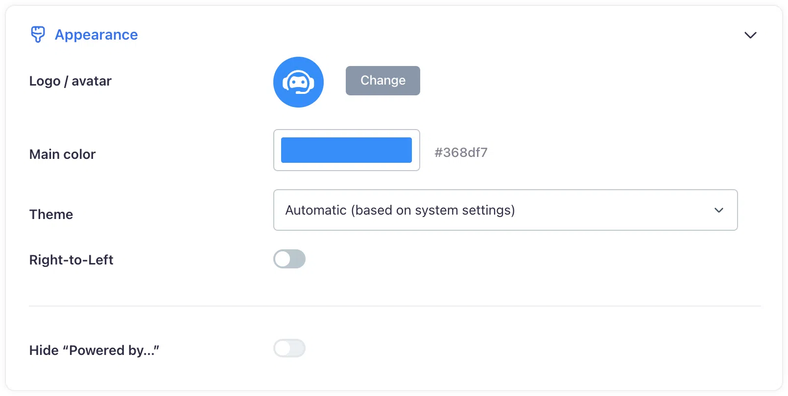
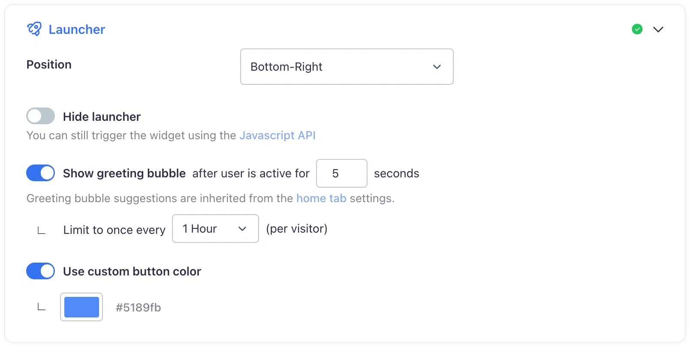

# Appearance and branding
## Customizing your Corpus chatbot widget to match your brand identiry

A chatbot is more than a customer service tool—it's an extension of your brand. Ensuring that your chatbot reflects your brand’s identity is crucial for maintaining professionalism and cultivating customer loyalty. The Corpus platform offers extensive customization options to align your chatbot's appearance with your brand image.

All appearance and branding options can be accessed through the **widget customization page** in your Corpus dashboard. As you make changes, preview them in real-time to ensure they meet your expectations before going live.

## Widget customization

With Corpus, you can fine-tune various elements of your chatbot to mirror your brand’s aesthetic and voice:

- **Chatbot Naming:** Choose a name that resonates with your brand and feels familiar to your customers.
- **Color Schemes:** Match the chatbot's color palette with your brand's official colors for a cohesive visual experience.
- **Avatar Selection:** Upload a custom avatar that represents your brand, whether it's a logo or a mascot.
- **Language Settings:** Set the language of the chatbot to align with your primary audience, ensuring clear communication.

## Launcher customization

The launcher of your chatbot is the first point of interaction between your customers and your AI assistant, and its appearance can significantly impact user engagement. In the launcher customization sectio, you have the opportunity to align this critical element with your brand's visual identity.

- **Launcher Location:** Decide where on your site the chatbot launcher will appear, ensuring it's visible without being intrusive.
- **Color Scheme:** Match the launcher's color palette with your brand's official colors for a cohesive visual experience.
- **Prompt Suggestions:** Craft prompt suggestions that not only engage users but also echo your brand's tone and messaging. You also have full control on delay time and frequency in which to display the prompt suggestions.

## Summary

The ability to customize your chatbot's appearance and branding is integral to presenting a professional image and building customer trust. Corpus provides a suite of options to ensure that your chatbot is not just a helpful assistant but also a true ambassador for your brand. By taking advantage of these customization features, you can create a chatbot experience that resonates with your customers and reinforces your brand identity.
