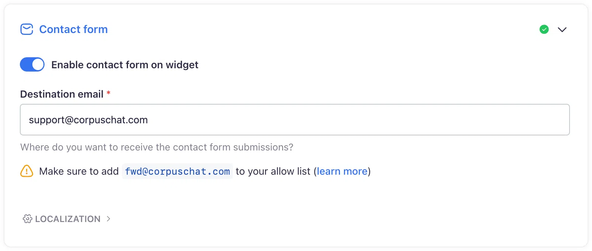

# Integrated contact form
## Optimizing customer support with Corpus' integrated contact form

Providing a seamless channel for customer support is crucial for enhancing user satisfaction and trust. The integrated contact form feature within the Corpus chatbot widget offers users an immediate and convenient method to reach out for human assistance directly from the chat interface.

This document details the functionality of the integrated contact form and how it can be utilized to maintain high-quality customer service.

## The asynchronous advantage

The Corpus contact form is a strategic tool that complements the chatbot's AI capabilities:

- **Near real-time response for users:** Customers can immediately articulate their concerns or escalate issues through the form, confident in a prompt AI-generated acknowledgment.
- **Asynchronous management for owners:** Site owners receive these inquiries via email or a ticketing system, allowing them to address them in a timely manner without the need for instant presence.

[[info]]
Corpus’ AI-powered chatbot paired with an integrated contact form delivers a near real-time support solution for users while providing site owners with the convenience of asynchronous communication. This dual approach caters to the dynamic needs of busy entrepreneurs, enabling them to concentrate on their business without the necessity of being on-call for support around the clock.
[[/info]]

## User-centric contact form

The Corpus integrated contact form bridges the gap between AI automation and the need for human interaction in customer support:

- **Direct communication:** Users can escalate issues or seek personalized assistance without leaving the chat interface.
- **Email integration:** Submitted forms are forwarded to an email address of your choice, which can be configured to link with your existing support ticketing system.

## Enhanced functionality

The contact form is designed to ensure a smooth user experience:

- **Image attachment:** Users have the option to attach an image or screenshot, providing visual context to their queries or issues.
- **Pre-filled information:** For logged-in or previously identified users, the contact form will auto-fill with their name and email, speeding up the process.
- **Automatic referrals:** When the chatbot cannot resolve a query with the information available in the knowledge base, it will direct users to the contact form for further assistance.

## Javascript API integration

For an even more streamlined experience, the widget's [JavaScript API](/widget/api.md) enables programmatic control over the contact formvisibility, allowifn you to provide users with access to human support whenever's needed.

## Customization options

Corpus offers flexibility in how the contact form is utilized within the widget:

- **Form visibility:** You can choose to hide the contact form if you wish to manage inquiries through other channels.
- **Multilingual and rtl support:** The form fully supports multiple languages, including right-to-left (RTL) languages, ensuring it caters to a diverse global audience.

## Summary

The Corpus integrated contact form is an essential feature for businesses that aim to combine the efficiency of AI with the irreplaceable human touch of customer service. By enabling direct, on-page communication, and providing flexible customization options, Corpus ensures that the transition from chatbot to human support is seamless and user-friendly. This integrated approach facilitates immediate customer assistance, ultimately contributing to a more responsive and empathetic customer support experience.
