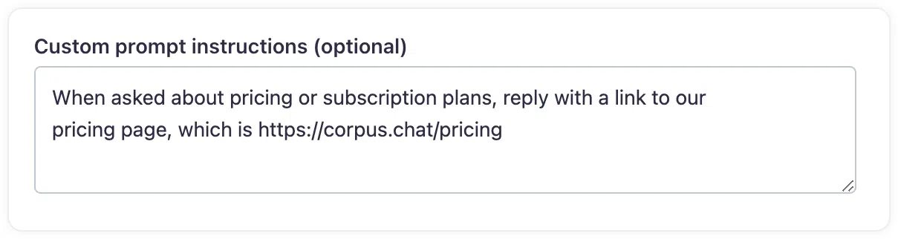

# Custom prompts
## Enhancing engagement with custom prompt instructions for Chatbot

Custom prompt instructions are a powerful feature of the Corpus chatbot, enabling you to refine the bot's responses to align with your communication strategy and enhance user interaction quality. This document provides guidance on how to implement these instructions to personalize the chatbot's tone, style, and content.

## Customizing response behavior

Example uses cases for custom prompt instructions are:

- **Direct to specific pages:** Guide users to relevant pages like the pricing page when certain topics are broached in the conversation.
- **Use of emojis:** Instruct the chatbot to incorporate emojis in its responses to add a friendly and relatable touch to the conversation.
- **Adopt a light-hearted tone:** Command the chatbot to ‘be funny’ or use a light-hearted tone to create a more enjoyable and memorable user experience.

## Implementing custom prompt instructions

To implement tailored instructions, navigate to the chatbot's response settings in the Corpus dashboard, and click on the <kbd>advanced</kbd> button in the "AI Chat" panel. Then,
dpecify your custom instructions in the designated area to inform the chatbot’s tone and response style. Once saved, your custom instructions will be implemented within minutes.

## Summary

Custom Prompt Instructions are essential for businesses that want to provide a unique and engaging chatbot experience. By customizing how your chatbot interacts with users, you can significantly improve the quality of your customer service and ensure that your chatbot is a true extension of your brand's personality. With these tailored instructions, your Corpus chatbot can deliver responses that are not only helpful but also resonate on a personal level with each user.
