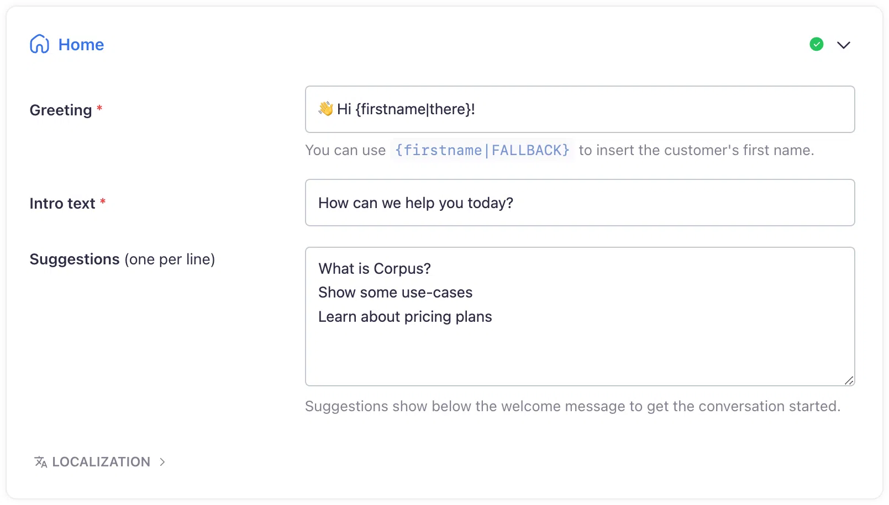

# Widget home screen
## Learn how to use the home screen to encourage engagement using a personalized greeting and a one-click conversation starters

The home screen of the Corpus chatbot widget serves as the virtual front door to your customer support and engagement strategy. Thoughtfully designed to welcome users and prompt interaction, the home screen is a critical touchpoint that can significantly enhance the user experience.

## Personalized greeting

Leverage personalized greetings to establish an immediate connection with users using **Personalization Tokens**. Incorporate `{firstname|FALLBACK}` within your greeting message to dynamically insert the user's name, provided they are identified, which adds a personal touch to the welcome message.

## Pre-defined prompt

Facilitate immediate interaction by setting up pre-defined prompts:

- **One-click queries:** Curate a list of prompts that users can click on to start a conversation, streamlining their path to engagement.
- **Visible cues:** These prompts are displayed even before the widget is opened, subtly encouraging users to engage with the chatbot.

[[tip Coming Soon — Expansion with apps]]
The home screen's capabilities are set to expand, integrating with applications to enhance user interaction like Calendly for appointments, uptime status for service availability, changelog updates, and more. These integrations will provide users with valuable tools and information directly on the home screen.
[[/tip]]

## Summary

The Corpus chatbot widget’s home screen is your opportunity to make a lasting first impression. By personalizing greetings, offering quick-start prompts, and planning for future app integrations, you can create an inviting and interactive experience for your users. Customizing the home screen is just one of the many ways Corpus allows you to cater to your customers' needs while showcasing your brand’s unique personality.
