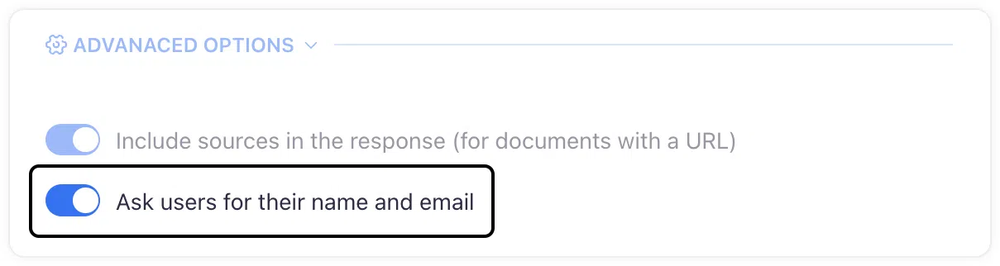

# Generating leads with Corpus
## Learn how set up your chatbot to capture leads through intelligent interactions

Lead generation is a pivotal feature of the Corpus chatbot, designed to convert casual conversations into valuable business opportunities. This document will walk you through the lead capture process integrated within the chatbot and explain how to manage this functionality to align with your business strategy.

## Lead generation functionality

The lead generation mechanism is intricately woven into the chatbot's conversational flow:

- **Default activation:** By default, lead capture is enabled, ensuring that every interaction has the potential to generate valuable leads.
- **Seamless identification:** For users already known to the system, the chatbot smartly bypasses the data collection step, streamlining their experience.
- **Prompting unknown users:** New users are gently prompted to provide their name and email after their first query, with a focus on maintaining a comfortable and pressure-free environment.

## User experience considerations

Understanding the importance of user comfort and consent in the data collection process:

- **Voluntary information sharing:** Users are not obligated to share their details immediately, with the option to do so later in the conversation.
- **User control:** The flexibility to opt out of lead capture is available in the advanced settings for those who prefer a non-intrusive approach.

## Lead management and analysis

Once captured, leads are accessible for further action and analysis:

- **Contacts screen:** View the list of leads and access their contact information conveniently from the Contacts screen.
- **Interaction review:** Dive into the Chat Session History screen to study the full interaction history for deeper insights and follow-up strategies.

## Summary

The Corpus chatbot's lead generation feature is an invaluable asset for businesses looking to nurture customer relationships and expand their clientele. By engaging users in meaningful dialogue and subtly integrating lead capture, Corpus creates a non-disruptive path to grow your contact base. With easy management and thoughtful user experience design, this feature stands as a testament to the chatbot’s role as a bridge between casual browsing and tangible business growth.
