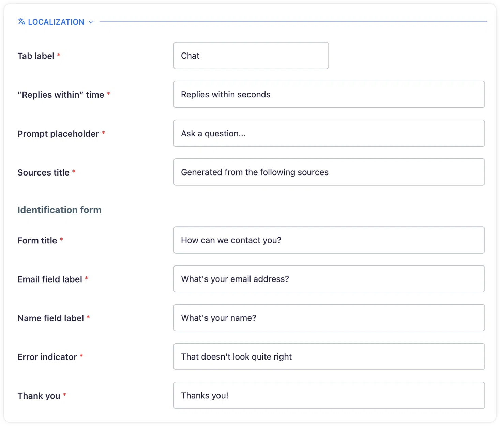

# Localization and multilingual support
## Leverage Corpus’ multilingual support and to enhance your customer interactions

In today's global marketplace, the ability to communicate with customers in their native language is invaluable. Corpus's localization options and support for non-English languages provide a versatile and inclusive platform for businesses to engage with a diverse customer base.

## Multilingual knowledge bases

Corpus allows you to train your chatbot using content in any language. This means that you can provide resources, FAQs, and data in the specific language of your target audience, ensuring that the chatbot's responses are not only accurate but culturally and contextually relevant.

- **Content diversity:** Incorporate a variety of linguistic content into your knowledge base.
- **Cultural nuance:** Train your chatbot to understand and respond with cultural nuances in mind.

## Widget customization

The user interface of your chatbot can be fully customized to match the language of your website. Corpus provides the flexibility to modify the language settings of your widget to create a consistent experience for users.

- **Language consistency:** Align the chatbot's language with that of your site.
- **Localization settings:** Easily access and change the language settings directly from the Widget screen.

## Right-to-left (RTL) support

Corpus ensures that languages written from right to left, such as Arabic and Hebrew, are fully supported. This includes the proper alignment of text and the adjustment of the user interface to accommodate the reading flow of RTL languages.

- **RTL adaptation:** The chatbot interface automatically adjusts for RTL languages.
- **Cultural inclusivity:** Engage with customers in a way that is respectful of their linguistic practices.

## Language-specific chatbots

To better cater to an international clientele, Corpus allows the creation of multiple chatbots in different languages. This approach enables businesses to provide dedicated support and a personalized experience for each language group.

- **Language-specific chatbots:** Offer specialized chatbots for different language speakers.
- **Tailored user experience:** Ensure that customers receive support in their preferred language.

## Localization settings

To customize the localization of your chatbot:

1. **Access widget settings:** Go to the Widget screen within the Corpus web application.
2. **Select localization:** Click on the <kbd>Localization</kbd> button found in each section of the widget settings.
3. **Edit language values:** Modify the default English values to your desired language for each customizable text field.

By following these steps, you can ensure that your chatbot communicates effectively with users in their native language, providing a seamless and localized user experience.

## Summary

Corpus's comprehensive localization and multilingual capabilities are designed to empower businesses to communicate with a global audience effectively. By leveraging these features, you can ensure that your chatbot is accessible, culturally aware, and ready to engage with customers in their language, fostering better relationships and improving customer satisfaction.
